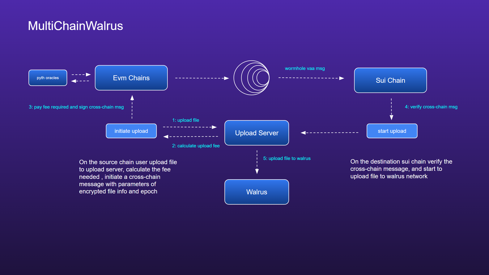

# MultiChainWalrus

Multi Chain Walrus is a permissionless, open-source cross chain walrus file uploader built on Wormhole primitives to facilitate cross-chain, one-click file upload.

* Empowerment: Enable cross-chain uploads via Walrus and use multi-currency as gas for uploads to drive broader adoption of Walrus, bringing various benefits to users.

* Economic Model: Implement an economic model by charging a small transaction fee to allow developers to generate revenue.

